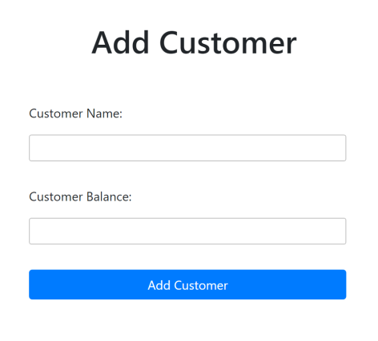
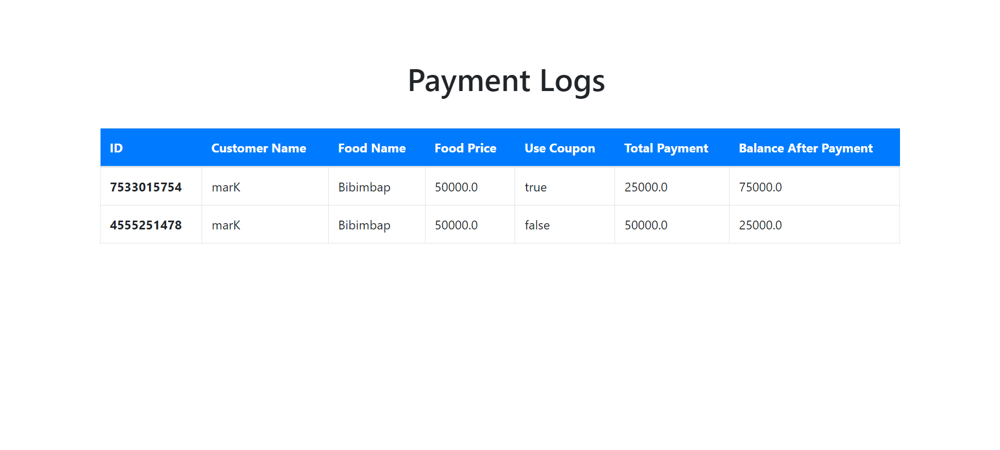

# Tutorial 6
Pada sesi tutorial kali ini, kamu akan menerapkan materi yang telah kamu pelajari yaitu terkait `asynchronous` dan `concurrency`.

# Asynchronous
Setelah berhasil membuat program-program yang hebat, namamu semakin terkenal. Setelah pencapaian yang begitu banyak kali ini kamu melamar di sebuah perusahaan yang ternama, StayJek.

Kamu ditempatkan pada divisi StayFood dimana pada divisi tersebut kamu berfokus untuk membangun fitur pesan makanan berbasis online. Pada saat ini, fitur StayFood memberi respon yang terlalu lama terhadap suatu permintaan yang tentunya tidak bagus bagi pengguna.

Saat ini, satu proses dari memesan makanan hingga selesai memakan waktu lebih dari **10000 ms** Kamu diminta untuk **menekan** waktu pemrosesan yang cukup lama ini agar setidaknya seluruh proses pada fitur BackFood berjalan di bawah **4000 ms**.

## Spesifikasi Program
Terdapat beberapa proses yang terjadi pada fitur StayFood dari pemesanan hingga selesai. Pada program terdapat 3 komponen utama, yaitu: `Customer`, `Food`, dan `Coupon`.

Terdapat 4 laman pada fitur StayFood
### Laman `/customer` 
untuk mendaftarkan `Customer` dengan jumlah saldo yang dimiliki.
  
### Laman `/coupon` 
untuk menambahkan `Coupon` yang dapat digunakan.    
  
### Laman `/order` 
untuk melihat seluruh pesanan yang dilakukan.
  
### Laman `/order/pay` 
berisi menu untuk melakukan pembayaran pemesanan.    
  

Kamu tidak perlu mengimplementasi penambahan `Customer`, `Coupon`, ataupun `Food` karena sudah disediakan oleh template.

Program akan menerima input berupa siapa `Customer` yang akan melakukan pembelian diikuti dengan `Food` yang akan dibeli dan `Coupon` yang akan digunakan. Setelah itu, program akan menghitung total harga yang perlu dibayar dari makanan yang dipesan dan akan mengurangi saldo `Customer`. Jika terdapat `Coupon`, maka perhitungan harga juga perlu disesuaikan.

## Requirements
- Ubahlah program sedemikian sehingga total waktu yang diperlukan mencapai target yang diminta.
- Kamu tidak diperkenankan menghapus atau mengubah `Thread.sleep` pada program.

# Concurrency
Kamu telah berhasil menekan waktu pemrosesan fitur StayFood sesuai target yang diminta. Kamu yang sedang gabut memutuskan untuk melihat-lihat keseluruhan kode fitur tersebut karena penasaran dengan cara kerja fitur tersebut. Kamu pun menemukan masalah baru yang dapat merugikan perusahaan. 

Saat kamu membuka 2 tab pada browsermu dan melakukan pemesanan menggunakan satu buah `Coupon` yang sama secara bersamaan, kedua pemesanan tersebut sukses dan mendapatkan pemotongan sesuai dengan diskon yang diberikan.

Mengingat bahwa satu `Coupon` hanya dapat digunakan sekali, hal tersebut akan menjadi masalah besar karena perusahaan bisa rugi besar atas potongan harga yang bisa didapatkan berkali-kali.

## Spesifikasi Prograam
- Terdapat satu buah laman `/log` yang berisi log dari semua pemesanan yang dilakukan.

Berikut merupakan kondisi dimana satu `Coupon` yang sama digunakan dalam dua pemesanan yang berbeda:

Berikut merupakan harapan kondisi yang terjadi, dimana satu `Coupon` hanya bisa digunakan untuk satu pemesanan:

## Requirements
- Ubahlah program sedemikian sehingga `Coupon` yang sama tidak bisa digunakan pada 2 pemesanan yang berbeda jika kedua pesanan tersebut dilakukan secara hampir bersamaan.
