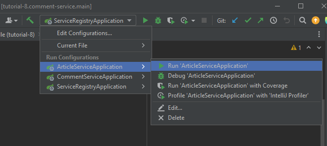

# Tutorial 8
Pada sesi tutorial kali ini, kamu akan menerapkan materi yang sudah dipelajari di sesi kelas mengenai `Microservice`.

## Microservice

Menggunakan pengalaman-pengalaman kamu dalam melakukan pemrograman, kamu sekarang ingin merintis aplikasi kamu sendiri. Aplikasi tersebut merupakan sebuah aplikasi
artikel sederhana yang dapat digunakan untuk menulis artikel dan mengomentari artikel yang ada. Sebut saja nama aplikasi tersebut _Small_.

Karena ini merupakan iterasi pertama dari pengembangan aplikasi _Small_, kamu belum berencana mengembangkan fitur autentikasi. Yang akan difokuskan pertama adalah pengembangan
logika bisnis dari pembuatan artikel dan komentar. Kedua fitur tersebut akan dipisah kedalam dua instance yang berbeda. Setiap instance akan dijalankan pada port yang berbeda dan
pada dua aplikasi Spring Boot yang terpisah. Untuk kebutuhan monitoring setiap instance yang ada nantinya, kamu juga akan menggunakan Eureka Service Registry.


## Eureka
Dalam arsitektur microservice, layanan umumnya didistribusikan di beberapa instance, sehingga sulit bagi klien untuk menemukan instance layanan yang sesuai untuk terhubung. Eureka memecahkan masalah ini dengan bertindak sebagai registry layanan, di mana setiap instance layanan mendaftarkan dirinya dengan Eureka dan memberikan metadata-nya, seperti host, nomor port dan informasi-informasi lainnya.

Pada projek ini, terdapat sebuah instance yang bernama _service-registry_ yang digunakan sebagai tempat diinstalnya Eureka Server. Nantinya, setiap instance lain akan mendaftarkan diri ke server tersebut.

### Konfigurasi Eureka
Ketika menggunakan Eureka, kamu perlu melakukan konfigurasi pada berkas `resources/application.properties` di service-registry. Berikut adalah konfirgurasinya,
```
...
server.port=8761
eureka.instance.hostname=localhost
eureka.client.register-with-eureka=false
eureka.client.fetch-registry=false
eureka.client.service-url.defaultZone=http://${eureka.instance.hostname}:${server.port}/eureka/
...
```

`resources/application.properties`yang berada pada setiap instance lain juga perlu dikonfigurasi untuk mendaftarkan diri pada Eureka server tersebut.
```
...
# eureka configuration
eureka.client.register-with-eureka=true
eureka.client.fetch-registry=true
eureka.client.service-url.defaultZone=http://localhost:8761/eureka/
eureka.instance.hostname=localhost
# additional
spring.application.name=<ISI NAMA INSTANCE>
...
```


## Rest Template
Merupakan sebuah class dalam Spring yang memungkinkan dua instance berbeda untuk saling berkomunikasi satu sama lain via API. Nantinya, instance
yang mengirim request dapat menerima data sesuai dengan endpoint yang dipanggil.

### Konfigurasi Rest Template
Hal pertama yang harus dilakukan untuk memakai Rest Template adalah menambahkan anotasi Bean Rest Template pada sebuah kelas konfigurasi yang sudah
diberi anotasi `@Configuration`. Simpelnya, kita define sebuah "global" variabel berbentuk Rest Template yang bisa dipakai di keseluruhan instance.

``` 
@Configuration
public class ApplicationConfig {

@Bean
public RestTemplate restTemplate() {
return new RestTemplate();
  }
  
}
```

Selanjutnya, kita dapat melakukan pemanggilan ke instance lain pada service dengan pertama melakukan instansiasi Rest Template pada Service aplikasi,

```
@Service
@RequiredArgsConstructor
public class RandomServiceNameImpl implements RandomServiceName {

....
    private final RestTemplate restTemplate;
    private String otherInstanceURL = <ISI_URL_Instance_Lain>;
....

```

Lalu, kita define sebuah method yang berguna untuk "menembak" endpoint yang berada di instance lain

```
@Override
public String getObjectViaAPI(Long objectId) {
    return restTemplate.getForObject((otherInstanceURL+objectId.toString()), String.class);
}
```

Penjelasan-penjelasan di atas merupakan cara yang paling dasar dalam penggunaan RestTemplate. Kamu bisa mencari tau lebih jauh tentang penggunaan-penggunaan
Rest Template yang lebih kompleks.

## Menjalankan instance berbeda
Pada aplikasi yang berbentuk microservice, kita dapat menjalankan setiap servicenya pada satu window Intellij. Buka root project `tutorial-8` sebagai sebuah projek, tunggu build lalu run seperti yang ada pada gambar.



## Menjalankan Next.js
Next.js merupakan sebuah framework yang dibuat di atas react. Pada tutorial ini kamu tidak perlu mengoding framework ini karena sudah tersedia. Yang perlu kamu lakukan hanyalah menjalankan instance frontend. Sebelum itu, kamu harus menginstall Node.js pada komputer. Anda dapat mengunduh Node.js melalui link [ini](https://nodejs.org/en). Setelah itu baca README yang ada pada instance frontend untuk guide menjalankan aplikasi. 

## Spesifikasi Program

Aplikasi terdiri dari dua fitur utama, yaitu:

1. CRD Artikel: Pengguna dapat membuat dan melihat setiap artikel yang sudah dibuat pada aplikasi

2. CRD Comment: Ketika pengguna sedang melihat sebuah artikel, pengguna dapat menambahkan komentar pada artikel tersebut.

3. Terdapat satu instance frontend app yang berjalan menggunakan framework js yang disebut Next.js. Kamu tidak perlu merubah apapun yang ada di frontend.

4. (Tips) Gunakan postman untuk mengecek apakah backend berjalan dengan baik atau tidak setelah kamu sudah mengimplementasikan fitur-fiturnya. Lalu, baru jalankan frontendnya. 

## Requirements


- [ ] Lakukan Set up database dan juga postman seperti yang sudah pernah dilakukan di tutorial sebelumnya. Buat sebuah database baru yang bernama tutorial-8 dan manfaatkan fitur ORM JpaRepository. Pastikan `application.properties` dari setiap instance sudah di konfigurasi. Gunakan tutorial terdahulu sebagai referensi.

- [ ] Membuat logika program dari fitur artikel
  - Membuat logika untuk create
  - Membuat logika untuk read all, dan read via Id
  - Membuat logika untuk delete

- [ ] Membuat logika program dari fitur komentar
  - Membuat logika untuk create
  - Membuat logika untuk read all komentar dari satu artikel Id
  - Membuat logika untuk delete

- [ ] Pastikan ketika pembuatan komentar dilakukan, artikel dengan postId tersebut sudah dibuat. Jika belum, kembalikan respon Bad Request. (Hint: Maanfatkan RestTemplate)

- [ ] Membuat konfigurasi dari Eureka sehingga setiap service terdaftar pada Service Registry

- [ ] Jalankan setiap service pada port yang berbeda, pastikan urutan build benar (Instance Eureka Server -> Instance-instance lain)

- [ ] Jalankan instance frontend dan pastikan setiap fitur berjalan dengan baik

- [ ] Memastikan ketika fitur komentar tidak dijalankan (backend dimatikan), pengguna masih dapat melihat artikel walaupun dengan ketiadaan section komentar

