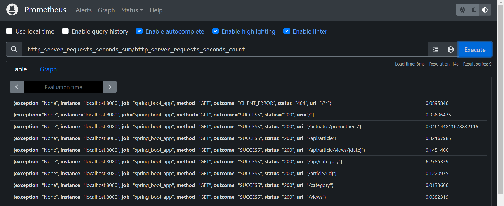
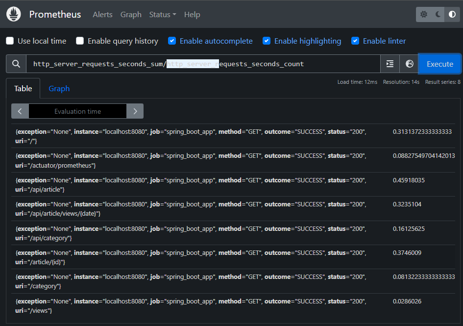

# Tutorial 9
Pada tutorial kali ini, kamu akan menerapkan materi yang sudah kamu pelajari di kelas mengenai `Profiling`. Tidak hanya itu, disini kamu akan mencoba menggunakan Prometheus dan Grafana untuk memonitor dan memvisualisasikan performa sebuah aplikasi.

## Profiling
Sampai saat ini, kamu telah melalui perjalanan cukup panjang. Kamu telah mendapatkan banyak pengetahuan serta pengalaman membangun sebuah aplikasi. Tentu kamu tidak ingin berhenti sampai disana. Kini kamu akan belajar mengidentifikasi dan menganalisis performa aplikasimu. Proses ini tentu sudah kamu kenal, yaitu dinamakan Profiling. Profiling tersebut dapat membantu kamu meningkatkan performa aplikasimu yang akan kamu terapkan pada tutorial ini.

## Spesifikasi Program
Fitur pada aplikasi ini, antara lain:
- Endpoint `/`: Menampilkan list artikel.
    

- Endpoint `/views`: Menampilkan list artikel berdasarkan tanggal tertentu.
    

- Endpoint `/category`: Menampilkan list category.
    

- Endpoint `/article/{id}`: Menampilkan detail sebuah artikel.
  

Tutorial ini juga memuat beberapa _guide_ lain yang bisa dibaca untuk memenuhi _requirements_:

- [prometheus.md](prometheus.md): berisi tutorial instalasi `prometheus`
- [grafana.md](grafana.md): berisi tutorial instalasi `grafana`

## Requirements
- [ ] Lakukan set up database seperti yang sudah pernah dilakukan di tutorial sebelumnya. Buat sebuah database baru yang bernama tutorial-9. Pastikan `application.properties` sudah di konfigurasi.
- [ ] Amati fitur pada aplikasi. Pada saat pertama kali dijalankan, akan ada sebuah mekanisme *seeding* untuk mengisi database dengan data-data yang banyak. Harap untuk tidak mengubah kode *seeding*.
- [ ] Lakukan set up Promotheus dan Grafana untuk menampilkan performa aplikasi.
- [ ] Analisis performa aplikasi dengan mengacu kepada daftar pertanyaan di bawah dan taruhlah hasil analisis kamu di file README ini.
  - Data apa saja yang dapat diamati melalui grafana? 
  - Berapa rata-rata response time dari setiap endpoint? 
  - Endpoint mana yang memiliki response time rata-rata paling cepat? 
  - Endpoint mana yang memiliki response time rata-rata paling lambat? Berapa response time rata-ratanya? 
  - Apa yang menyebabkan response time endpoint tersebut lambat?
  - Berapa response time rata-rata endpoint tersebut setelah dioptimasi?
  - Bagaimana pengaruh endpoint yang lambat tersebut terhadap JVM memory?
- [ ] Berdasarkan hasil profiling dan analisis yang kamu lakukan, periksa fitur yang paling lambat dan lakukan optimasi pada implementasinya.

## Analysis
1. Data apa saja yang dapat diamati melalui grafana?
  - Uptime
  - Start time
  - Heap used
  - Non-Heap used
  - I/O Overview (Rate, Errors, Duration, Utilisation)
  - JVM Memory (JVM Heap, JVM Non-Heap, JVM Total, JVM Process Memory)
  - JVM Misc (CPU Usage, Load, Threads, Thread States, GC Pressure, Log Events, File Descriptors)
  - JVM Memory Pools Heap (G1 Eden Space, G1 Old Gen, G1 Survivor Space)
  - JVM Memory Pools Non-Heap (Metaspace, Compressed Class Space, CodeCache)
  - Garbage Collection (Collections, Pause Durations, Allocated/Promoted)
  - Classloading (Classes Loaded, Class delta)
  - Buffer Pools (direct, mapped, mapped -'non-volatile memory')

2. Berapa rata-rata response time dari setiap endpoint?
   
  - uri="/": 0.33636435
  - uri="/actuator/prometheus": 0.046144811678832116
  - uri="/api/article": 0.32167985
  - uri="/api/article/views/{date}": 0.1451466
  - uri="/api/category": 6.2785339
  - uri="/article/{id}": 0.2292273
  - uri="/category": 0.0133666
  - uri="/views": 0.0382319

3. Endpoint mana yang memiliki response time rata-rata paling cepat? 
   - API / Backend: uri="/api/article/views/{date}"
   - Frontend: uri="/category"

4. Endpoint mana yang memiliki response time rata-rata paling lambat? Berapa response time rata-ratanya?
    - API / Backend: uri="/api/category" (6.2785339)
    - Frontend: uri="/" (0.33636435)

5. Apa yang menyebabkan response time endpoint tersebut lambat?
   - Terdapat nested loop pada method getListCategory() yang berada di class CategoryServiceImpl.java untuk mencari sekaligus menset MostRecentArticle dan NumArticles sehingga kompleksitas code menjadi o(m*n), dimana m adalah jumlah data kategori dan n adalah jumlah data artikel yang memiliki category tersebut. Karena nested loop inilah yang membuat waktu eksekusi sekaligus response time menjadi lama
   - Solusi: menghapus loop terdalam (mencari MostRecentArticle dari category tersebut) dan mengubahnya menjadi query sql biasa. Karena implementasi dalam menentukan MostRecentArticle berubah, maka kita juga harus mengubah implementasi dalam menentukan NumArticles agar response time dapat lebih dipercepat.

6. Berapa response time rata-rata endpoint tersebut setelah dioptimasi?
   
   - uri="/": 0.3131372333333333
   - uri="/actuator/prometheus": 0.08827549704142013
   - uri="/api/article": 0.45918035
   - uri="/api/article/views/{date}": 0.3235104
   - uri="/api/category": 0.16125625
   - uri="/article/{id}": 0.3746009
   - uri="/category": 0.08132233333333333
   - uri="/views": 0.0286026

7. Bagaimana pengaruh endpoint yang lambat tersebut terhadap JVM memory?
    - Karena pada endpoint yang lambat tersebut terdapat nested loop dengan assignment temporary variable, mengakibatkan JVM memory perlu untuk menggunakan memory lebih banyak untuk menyimpann assignment temporary variable tersebut. 
    - Dengan kata lain, nested loop tersebut juga mengakibatkan kurang efisiennya penggunaan memory pada program java.