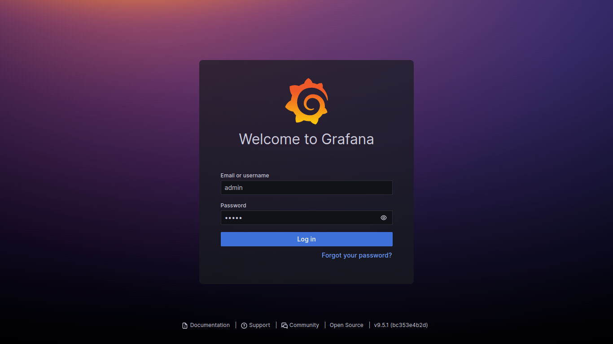
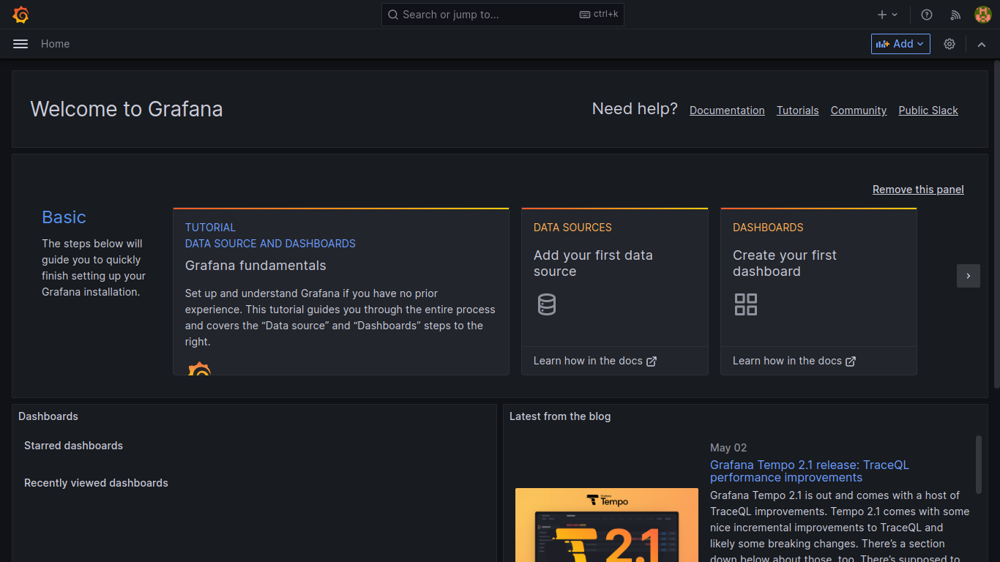
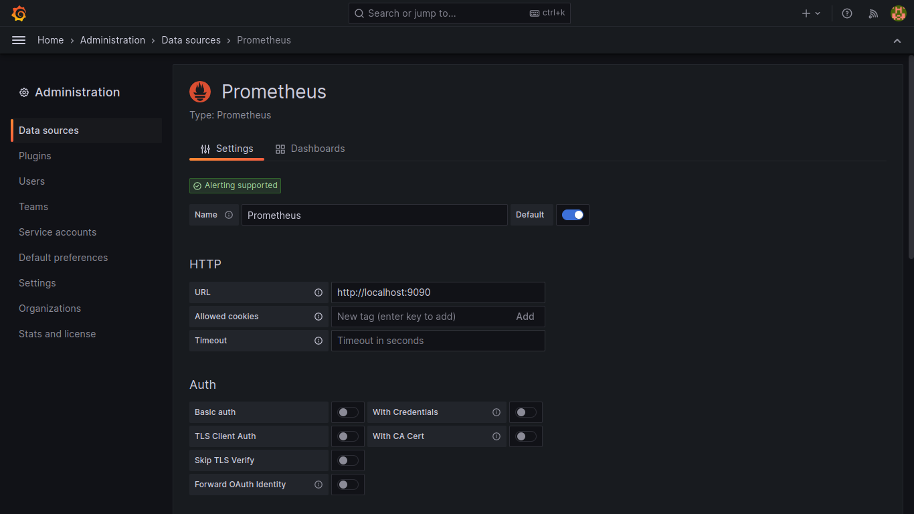
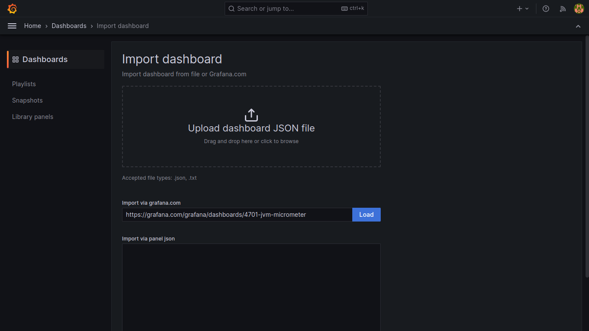
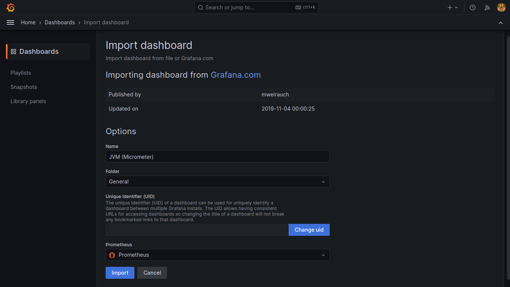

## Tutorial Setup Grafana

Grafana merupakan aplikasi open-source yang dapat membantu kamu dalam memantau dan menganalisa metriks dengan berbagai jenis sumber. Kali ini, kamu akan menggunakan Grafana untuk mengambil data dari Prometheus sehingga dapat dimanfaatkan untuk membuat dashboard yang mudah dipahami.

1. Jika kamu belum pernah menginstal Grafana sebelumnya, silakan install terlebih dahulu sesuai dengan sistem operasi komputermu [di sini](https://grafana.com/grafana/download).
   Berikut ini salah satu cara untuk dapat menggunakan Grafana yaitu dengan membuat Docker container.

   `docker pull grafana/grafana`

   `docker run -d --name=grafana -p 3000:3000 grafana/grafana`

2. Silakan buka `http://localhost:3000` dan pastikan Grafana sudah dapat digunakan.

3. Kamu dapat login dengan menggunakan `username=admin` dan `password=admin`.
   

4. Pastikan kamu sudah selesai melakukan konfigurasi Prometheus. Selanjutnya, silakan tekan "Add your first data source" dan pilih Prometheus sebagai _data source_.
   

5. Kemudian, isi nama dan URL dari Prometheus yang sudah kamu konfigurasi lalu simpan dengan membiarkan konfigurasi lainnya secara default.
   

6. Untuk tutorial ini, kamu akan memanfaatkan JVM Micrometer Dashboard yang telah tersedia. Silakan menuju `dashboard > new > import` dan isi import via grafana.com dengan `https://grafana.com/grafana/dashboards/4701-jvm-micrometer`.
   

7. Pastikan memilih _data source_ Prometheus yang sudah ditambahkan sebelumnya kemudian klik import.
   
