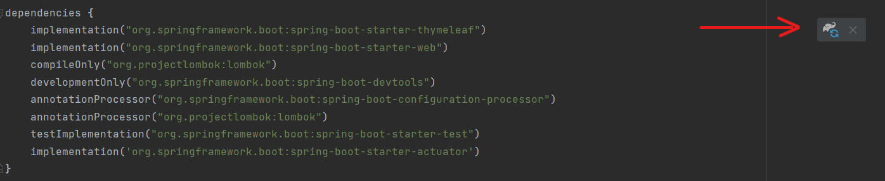
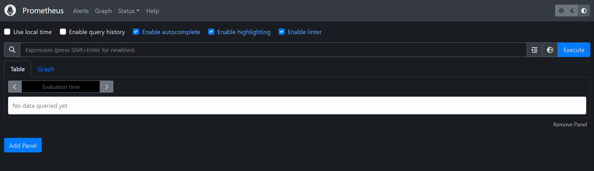
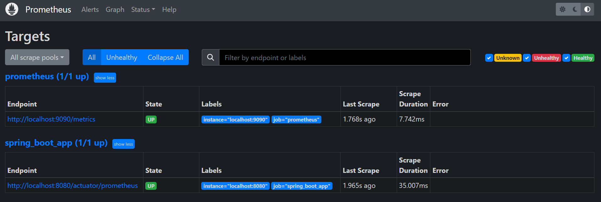

## Tutorial Setup Prometheus

1. Buka file `build.gradle` 
   lalu tambahkan dependency `implementation 'org.springframework.boot:spring-boot-starter-actuator'`. 

   Note: pakai double-quote, bukan single-quite.

2. Refresh Gradle
   

3. Tunggu sampai gradle selesai build pada kanan bawah Intellij

4. Coba jalankan aplikasi Springboot dan kunjungi http://localhost:8080/actuator 

   Pastikan halaman tersebut dapat diakses dan memberikan suatu json

5. Kunjungi https://prometheus.io/download/ dan pilihlah OS yang sesuai dan kemudian download.

   Contoh ini akan menggunakan prometheus-2.43.0.windows-amd64.zip 
   
   Kamu juga bisa meng-_install_ prometheus dengan menggunakan docker (https://prometheus.io/docs/prometheus/latest/installation/)

6. Extractlah zip tersebut dan jalankan `prometheus.exe` (sesuaikan dengan OS anda)
7. Coba kunjungi http://localhost:9090/

   Seharusnya Anda sekarang sudah bisa mengakses halaman tersebut.
   


8. Tambahkan `implementation 'io.micrometer:micrometer-registry-prometheus'` pada build.gradle
9. Refresh Gradle lagi
10. Pada `application.properties`, tambahkan `management.endpoints.web.exposure.include=*`
11. Restart aplikasi Springboot Anda. Pastikan kini Anda bisa mengunjungi http://localhost:8080/actuator/prometheus
12. Pastikan bahwa sekarang Anda dapat mengakses http://localhost:8080/actuator/prometheus

13. Pada folder letak disimpannya prometheus.exe, coba buka `prometheus.yml` 

14. Pada section `scrape_configs`, coba tambahkan:

```yaml
  - job_name: 'spring_boot_app'
    metrics_path: '/actuator/prometheus'
    static_configs:
      - targets: ['localhost:8080']
```

15. Coba restart prometheus.exe kemudian kunjungi http://localhost:9090/targets 
    dan pastikan spring_boot_app terdaftar di sana. 
    Apabila belum muncul, cobalah tunggu sekitar 15 detik
    

